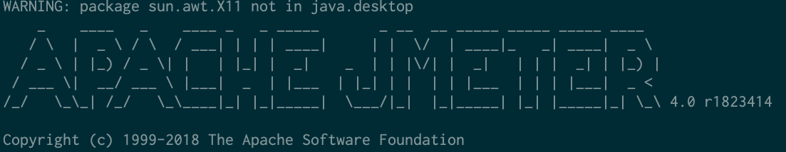

Supongamos que tiene que mantener un JMeter script que originalmente fue creado usando la versión 4.0, y que no es compatible con la versión que está instalada en su laptop.

Por ejemplo, supongamos que tiene la versión 5.1.1 instalada en su Mac.  El siguiente comando, ejecutado en un terminal, muestra la versión instalada:

    brew info jmeter
    jmeter: stable 5.1.1 (bottled)
    Load testing and performance measurement application
    https://jmeter.apache.org/
    /usr/local/Cellar/jmeter/5.1.1 (2,607 files, 134.3MB) *

Usualmente, brew sería la utilidad para también instalar la versión 4.0; desgraciadamente brew no permite instalar versiones alternativas. Felizmente, hay una alternativa muy simple basada en el comando CURL. Esta es la secuencia:

    curl -SL https://archive.apache.org/dist/jmeter/binaries/apache-jmeter-4.0.zip | tar -xf - -C /usr/local/Cellar/jmeter
    cd /usr/local/Cellar/jmeter
    mv apache-jmeter-4.0 4.0 # cambio de nombre!

El siguiente comando de brew muestra que las dos versiones:

     brew info jmeter
    jmeter: stable 5.1.1 (bottled)
    Load testing and performance measurement application
    https://jmeter.apache.org/
    /usr/local/Cellar/jmeter/apache-jmeter-4.0 (2,339 files, 83.8MB)
      Built from source
    /usr/local/Cellar/jmeter/5.1.1 (2,607 files, 134.3MB)
      Built from source

Lo único que queda es alternar las versiones de la siguiente manera:

    brew switch jmeter 4.0
    Cleaning /usr/local/Cellar/jmeter/5.1.1
    Cleaning /usr/local/Cellar/jmeter/4.0
    101 links created for /usr/local/Cellar/jmeter/4.0

    jmeter --version

¡Saludos!