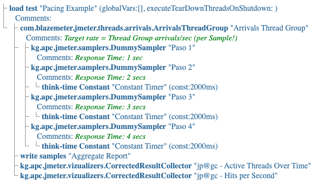
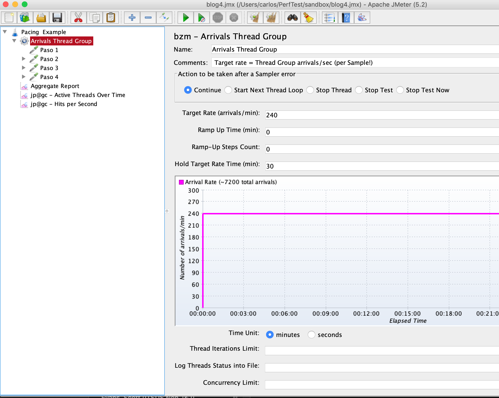
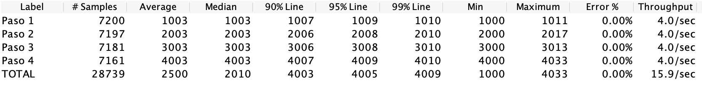
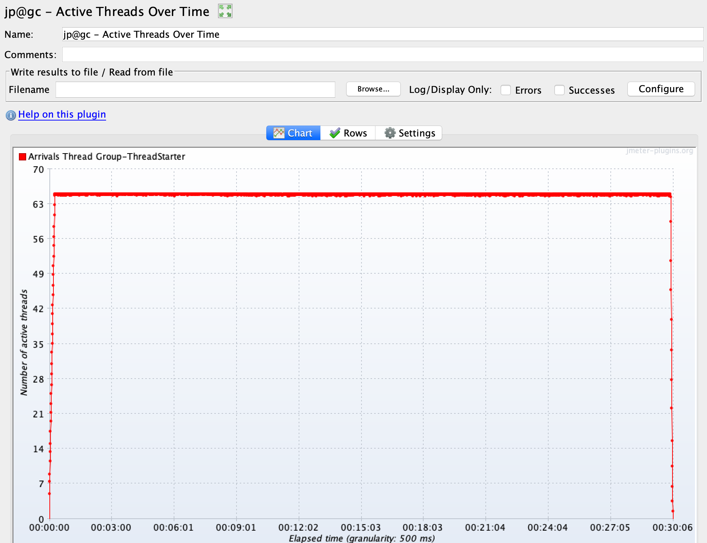

El propósito de ésta entrada es describir una técnica para especificar el ritmo de llegada de usuarios a una aplicación en la Web. _Nota_: en Inglés __ritmo de llegada__ se conoce Pacing, que es el término que vamos usar en este artículo.

### ¿Que es Pacing?

Pacing es el intervalo de arribo de las visitas a una aplicación de Internet. Pacing representa el     número de escenarios de prueba que ocurren en cierto periodo de tiempo. Nota: ver el blog de mi colega Antonio para una [excelente explicación](https://jmeterenespanol.org/blog/2019-10-20-escenario-antonio/) acerca de escenarios de prueba.

Asi mismo, Pacing representa un __requerimiento__ en el sentido que Pacing define el objetivo (en términos de visitas por hora, por ejemplo) que se espera que una aplicación pueda soportar. En otras palabras, es un __criterio de aceptación__ de los resultados de la prueba de carga (otro criterio de aceptación podría ser los tiempos de respuesta, por ejemplo).

Incorporando Pacing en un test permite regular el ritmo de llegada a la aplicación y asi precisamente llegar a la carga deseada.  Como consecuencia, esto permite determinar la _capacidad_ de carga que la aplicación puede aceptar o soportar.

Finalmente, es importante mencionar que esta técnica se aplica a las aplicaciones que son del tipo  __modelos abiertos__ donde las visitas a la application llegan en forma independiente (asíncronas). Dicho sea de paso, esta es la característica que tienen la mayoría de cargas de trabajo que acontecen en el Internet (por ejemplo, e-commerce).

### La técnica usando Arrivals Threads Group

Hay varias técnicas para implementar Pacing en JMeter, pero este artículo se enfoca en una basada en el [Arrivals Threads Group](https://jmeter-plugins.org/wiki/ArrivalsThreadGroup). Lo importante de este TG es que mantiene la carga (workload) creando los threads/vusers que son a necesarios.

Demostramos como funciona usando un ejemplo sencillo. En este ejemplo, el cliente requiere que la aplicación soporte 240 visitas/minuto. Trabajando con el cliente diseñamos lo que constituye una visita o session:



Como lo muestra este gráfico, la sesión esta compuesta de cuatro pasos (implementados usando un [Dummy Sampler](https://jmeter-plugins.org/wiki/DummySampler/)). Cada paso es asignado un "Response Time" y para los tres últimos pasos un ThinkTime constante de 2 segundos respectivamente. Adicionalmente, usamos 3 listeners que nos ayudaran a analizar los resultados.

El gráfico a continuación muestra la configuración del Arrivals Threads Group. Puesto que el requerimiento de Pacing es de 240 visitas/minuto entramos esta cantidad en el área "Target Rate (arrivals/min)". Adicionalmente, entramos la duración del test de 30 minutos en el área de "Hold Target Rate Time (min)".

```
Aclaración importante: Pacing se aplica a la sesión completa, y como consecuencia a cada uno de los pasos (requests) del scenario.
```



### Resultado y Análisis

Al término del test, el Aggregate Report listener muestra los siguientes resultados:



Primero, observamos que el número aproximado de ejecuciones para cada uno de los pasos (samples) es 7,200. Dividiendo este número por 30 (duración en minutos) el resultado es 240 ejecuciones por minuto. Este es el requerimiento del test!

Como mencionamos al principio, el Arrivals TG genera los Threads/VUsers necesarios para mantener la carga.  Para determinar este número podemos usar el plugin [Active Threads Over Time](https://jmeter-plugins.org/wiki/ActiveThreadsOverTime/) de esta manera:



De acuerdo al gráfico, el número aproximado de VUsers es alrededor de 64. Alternativamente, los VUsers (usuarios activos) se calculan usando una de las leyes de la Teoría de Colas, Little's Law. Específicamente:

```
# de usuarios activos = # de usuarios en proceso + # de usuarios en pausa (ThinkTime)

# de usurarios activos = (Avg Throughput * Avg ResponseTime) + (Avg Throughput * Avg ThinkTime)

# de usurarios activos = 15.9 * 2.5 + 15.9 * 1.5 = 63.60
```

### Conclusión

Aunque el Arrivals Threads Group es intuitivo y relativamente fácil de configurar, tiene algunas limitaciones: los usuarios arriban un ritmo de llegada _constante_, lo cual no es realista puesto en la Web el arribo de visitas es totalmente arbitrario/aleatorio. Adicionalmente, estimar el número de usuarios activos (vusers) no es un proceso directo.
