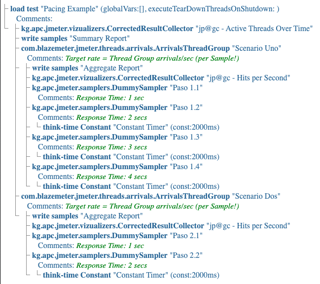
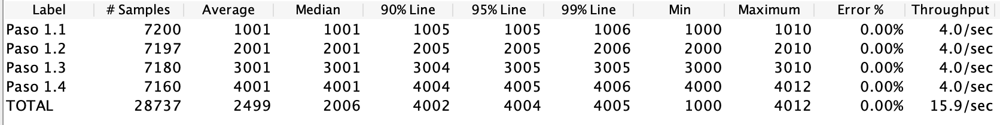
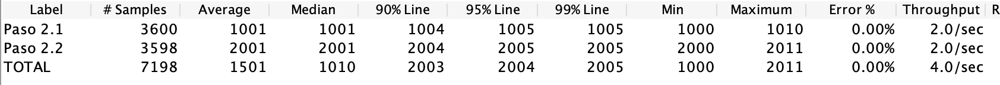
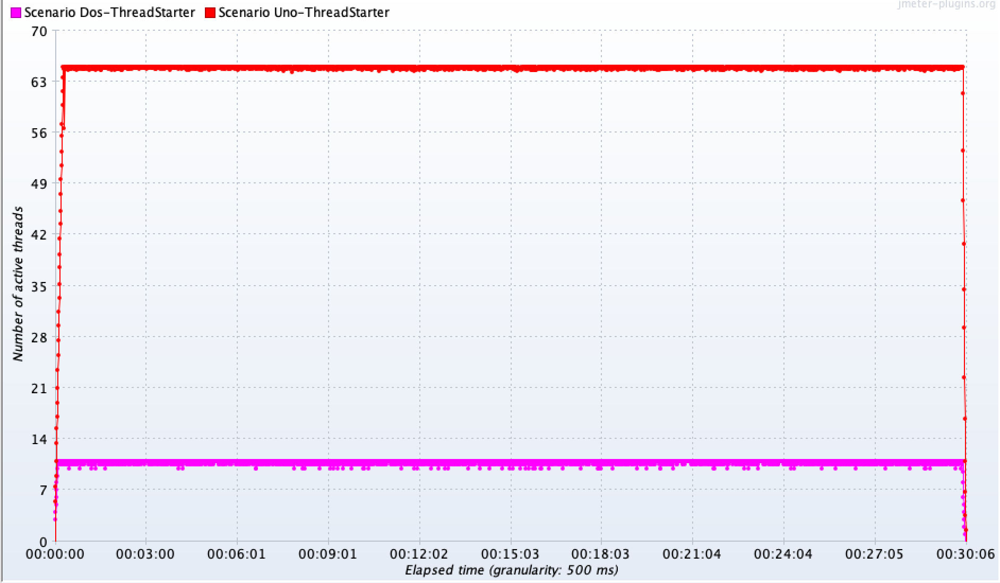

En esta entrada mostramos una aplicación práctica de la técnica presentada en el blog anterior.

**Nota**: en Inglés *ritmo de llegada* se conoce como *pacing*, que es el término que vamos usar en este artículo.

Empezamos aclarando el concepto que presentamos en el blog anterior: el *pacing* se aplica a cada uno de los componentes del escenario en forma individual. Por ejemplo, si una sesión/flujo esta compuesto de 10 transacciones (HTTP requests), cada una será ejecutada 10 veces, independientemente del tiempo de respuesta particular a cada transacción.

### El Requerimiento

Supongamos que esta vez el cliente requiere un *workload* compuesto por dos flujos/escenarios, cada uno de los cuáles está constituido por cierto número de pasos (requests). El requerimiento de *pacing* es como sigue:

| Escenario | Pacing | Porcentaje |
|-----------|--------|------------|
| Uno | 240 Visitas x Minuto | 66%
| Dos | 120 Visitas x Minuto | 33%

El diagrama a continuación muestra el modelo con dos *thread groups*, que corresponden a cada uno de los escenarios:



Cada uno de los escenarios se configuran tal como lo demostramos en nuestro [blog anterior](https://jmeterenespanol.org/blog/2020-01-28-pacingtechnique-1-2-carlos/)

### Resultado y Análisis

Al final del *test*, el __Aggregate Report Listener__ muestra los siguientes resultados para el primer y segundo escenario respectivamente:





Comprobamos que la meta de *pacing* de ha cumplido usando el mismo método descrito en blog previo.

### Número de Usuarios Activos

El número total de usuarios se estima usando la misma metodología mencionada en nuestro blog anterior:

```
# de usuarios activos = # de usuarios en proceso + # de usuarios en pausa (ThinkTime)
# de usurarios activos = (Avg Throughput * Avg ResponseTime) + (Avg Throughput * Avg ThinkTime)
```
Escenario Uno:
```
# de usurarios activos = 15.9 * 2.5 + 15.9 * 1.5 ≈ 64
```
Escenario Dos:
```
# de usurarios activos = 4.0 * 1.5 + 4.0 * 1.0 ≈ 10
```

<span style="color:red">Nota:</span>: El porcentaje de distribución de los 74 usuarios activos es aproximadamente 86% y 14% respectivamente.

Gráficamente, el número de usuarios activos es como sigue:



Es importante resaltar una observación relacionada al número total de **usuarios activos**.

En la tabla donde señalamos los requerimientos, notamos que el porcentaje de visitas está distribuido en 66% para el Escenario Uno, y 33% para el Escenario Dos. Lo **intuitivo** sería configurar los *VUsers* de acuerdo a esta misma distribución.

Desafortunamente el *pacing* resultante sería <span style="color:red">incorrecto</span>! El 66% y 33% del número de usuarios activos (74) es aproximadamente 48 y 26 usuarios respectivamente. Esta distribución de usuarios no cumple con el requerimiento de *pacing* establecido por el cliente. Como ejercicio, los invito a comprobar que éste es el caso.

## Conclusiones

En este artículo confirmamos que el Arrivals Threads Group es intuitivo y relativamente fácil de configurar incluso en el contexto de cargas de trabajo complejas. Adicionalmente, este blog muestra que configurar usuarios sin claramente entender las características de la carga de trabajo, puede derivar en resultados equivocados.