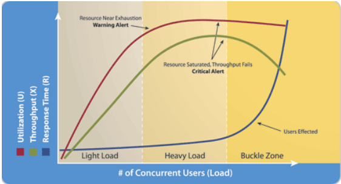

En esta entrada discutimos los llamados **tres pilares** de las pruebas carga.

Los tres pilares de las pruebas de rendimiento son: Capacidad de Procesamiento, Tiempo de Respuesta, y Utilización. Estas tres métricas son indispensables para diseñar pruebas de rendimiento efectivas e interpretar correctamente los resultados.

**Nota**: en Inglés *pruebas de carga* se conoce como *Load Testing o LT*, que es el término que vamos usar en este artículo.

### Definiciones

Empezamos definiendo un término que identifica el ambiente donde la aplicatión se ejecuta. Este término en Inglés es conocido como el **Sytem Under Test o SUT**. En general, el *SUT* describe a un conjunto de componentes usualmente organizado en varias capas hardware, cada una desempeñando una specífica función. Por ejemplo: application server, web server, etc.

Capacidad de Procesamiento (usamos el término en Inglés: **Throughput**): es un **ratio** o proporción que representa la cantidad de trabajo completado en un periodo definido de tiempo. Por ejemplo, transacciones por minuto.  En el caso de JMeter, el *listener Summary Report* proporciona el *throughtput* promedio para la totalidad de las transaciones y para cada una individualmente.

Tiempo de Respuesta (usamos el término en Inglés: **Response Time**): es una **cantidad** que representa el tiempo que transcurre desde que el usuario envia una transacción hasta que recibe la respuesta completa.  En el caso de JMeter, el *listener Summary Report* también reporta el *Response Time* promedio para la totalidad de las transacciones y para cada una individualmente.

Utilización (usamos el término en Inglés: **Utilization**): es un **porcentaje** que representa qué tan ocupado ésta un recurso en el *SUT* (CPU, Mem, I/O, etc) en un momento especifico.

JMeter no reporta la *Utilization* directamente; es necesario instalar el [Performance Monitoring](https://jmeter-plugins.org/wiki/PerfMon/) *plugin* e inicializar el [perform-agent](https://github.com/undera/perfmon-agent) en el *SUT*.  Una alternativa más efficiente es usar un [Application Performance Management (APM)](https://en.wikipedia.org/wiki/Application_performance_management). Por ejemplo, New Relic, Dynatrace, etc.

### Perspectiva Gráfica

El gráfico muestra las tres métricas como **función** de la carga creada por Usuarios Concurrentes. En otras palabras, incrementos en la carga directamente impactan el *Throughput*, *Response Time*, y *Utilization*. Inicialmente, esta relación es más o menos lineal (Light Load). Eventualmente, incrementos subsiguentes del *load* que hacen que la relación se transforme en **no-lineal** (Heavy and Buckle zones).

Un ejemplo típico que demuestra esta forma *no-lineal* es la saturación de los CPUs cuando el número de procesos supera el númbero de CPUs (*Utilization*).  El *Response Time* se incrementará progresivamente cuando el número de procesos adicionales esperan la oportunidad de ejecución, y como consecuencia, el *Througput* también disminuirá progresivamente.

Este concepto, ciertamente contraintuitivo, es fundamental para diseñar una carga efectiva e interpretar los resultados correctamente.

### Usos prácticos

Un uso práctico de estas 3 métricas es en la interpretación de los resultados de una prueba de carga.  Para un número determinado de VUsers, los resultados en el *Summary Report* muestran una combinación de *Throuhput* y *Response Time*, pero sin información acerca de la correspondiente *Utilization* no hay manera de identificar en que sección en el gráfico (arriba) los resultados estan situados. Podrían estar en la zona de *light load*, en cuyo caso el ambiente podría estar sobre configurado; por otro lado, si los resultados estan en la zona de *buckle zone* un incremento súbito del *load* causaría que el test produzca resultados inaceptables, probablemente porque la capacidad de *SUT* está al limite.

Otro uso práctico está relacionado a la especificación de los requerimientos o metas del *LT*.  Es usual indicar los requerimientos de un *LT* exclusivamente en términos de número de usuarios (VUsers).  Este requerimiento es incompleto puesto que el número actual de usuarios que una aplicación puede soportar no se conoce de antemano. Un requerimiento más claro debería estar acompañado por información detallada acerca de carga, especialmente la frecuencia que cada uno de los componentes de la carga es ejecutada; en otras palabras, el *throughtput* esperado.  Igualmente, el *response time* correspondiente a cada componente de la carga es particularmente relevante. Finalmente, especificando el nivel de *utilization* para cada uno de los componentes del *SUT* indica el consumo deseado de los recursos del hardware.  

### Conclusión

Los tres pilares de las pruebas de rendimiento son indispensables para diseñar pruebas de rendimiento e interpretar los resultados correctamente.  Lo importante es que esta 3 métricas dan *contexto* en las fases de requerimientos, diseño, interpretación de resultados.
