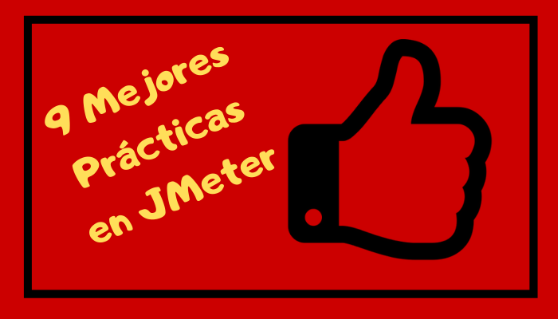

En esta entrada listamos las mejores prácticas en JMeter. Lo interesante de esta lista es que es fue propuesta por de dos de los mas conocidos expertos en el mundo de JMeter: Phillipe Mouawad y Antonio Gomes Rodrigues. Ellos son los autores de un libro que en mi opinion es un de los mejores actualemente: [Master Apache JMeter From load testing to DevOps]. Les recomiendo la version *ebook*. Yo he añadido comentarios y ejemplos para clarificar algunos de los conceptos.

[Interview with two JMeter developers and authors of the book Master JMeter] (https://www.youtube.com/watch?v=0CcUqfuOi0I)

## Documentacion obsoleta

Puesto que JMeter ha estado en le mercado por muchos años hay que tener cuidado en consultar blogs, videos, y otra documentacion que probablemente este obsoleta. La mejor practica es consultar la [documentation official](https://jmeter.apache.org/usermanual/index.html) y la historia del cambios atravez de las [differentes versiones](https://jmeter.apache.org/changes_history.html)

## Performance

La mejor practica es **no** usar BeanShell o Javascript por que degradan significamente el performance de la herramienta. La mejor practica is usar JSR223 que usa Groovy como default. Groovy es un lenguage moderno y poderoso que funciona con la últimas version de Java.

## Usar el modo Non-Gui

La mejor practica es **no** user el modo Non-GUI para las pruebas de carga. El modo GUI se usa en la fase de desarrollo del script, pero que una vez esta fase esta completa la recomendacion is cambiar al modod non-GUI

## HTML Reported


## No XML modificaciones directas

La mejor practica es **nunca** manipular directamente el XML file donde JMeter archiva el test (*.jmx file).

## Entender el concepto de **scoping**

En breve **scoping** es ...
[Orden de ejecución en JMeter](https://jmeterenespanol.org/blog/2019-10-04-ejecucion-antonio/)

## Variables y Propiedades

La mejor práctica es claramente entender la diferencias entre Variables y Propiedades.  Una *variable* ... 

## Use Funciones 

JMeter provee una lista muy completa de funciones que permiten optimizar el creación de *scripts* de pruebas. La mejor práctica es familiarizarse y usar estas funciones en véz de tratar de 'reinventar la rueda'. Por ejemplo, nuestro ilustre colega Antonio nos presenta algunas [funciones para especificar valores de tiempo](https://jmeterenespanol.org/blog/2019-11-15-functiempo-delvis/)

Por si esto fuera poco, JMeter tiene un *plugin* que 

Ejemplo muy común es usar la función UUID (Universal Unique ID) para crear una direción de email aleatoria en la siguiente forma:

```
{
    "email": "${__substring(${__UUID()}, 0, 8)}.${__substring(${__UUID()}, 25, 35)}@gmail.com", 
}
```
Nota: el ejemplo usa la función *substring* que es parte el plugin mencionado.

## Modelos Abiertos vs Modelos Cerrados

La mejor practica es user el modelo correcto para la aplicacion que se esta probando
