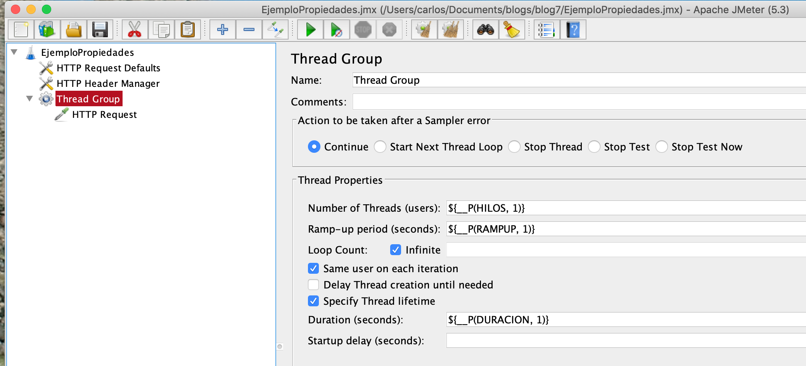

En esta entrada planteamos dos opciones como inicializar propiedades en JMeter.

Empezamos definiendo que es un propiedad. En JMeter, una propiedad es un valor *dinámico* que es común a **todos** los hilos/VUser.  Usualmente se utiliza para definir la información especifica al *ambiente de ejecución* de una prueba. Acceso a las Propiedades es a través de la función *__P()*. Por ejemplo, la propiedad *PropX* será leída usando *${__P(PropX)}*.

**NOTA**: en mi último [blog](https://jmeterenespanol.org/blog/2020-04-13-practicas-carlos/), mencioné dos buenas prácticas relacionadas a este tema:

* Usar el modo Non-Gui (CLI)
* Variables y Propiedades

## Importancia

La habilidad de inicializar propiedades tiene la importante ventaja de permitir modificar el funcionamiento del script **externamente** y en forma **dinámica**. Por ejemplo, supongamos que tenemos un script que prueba el performance de una applicación en la Web. Durante el proceso de desarrollo de esta aplicación, el test se puede inicialmente dirigir al ambiente de *desarrollo*, y posteriormente al ambiente de *QA*. En este caso, usando una propiedad para configurar el script, podemos alterar el URL que representa el ambiente de prueba sin tener necesidad de editar/alterar el script directamente.

## Ejemplo

En el siguiente gráfico, inicializamos la configuración de un *tread grupo* usando 3 propiedades:



**NOTA**: Propiedades pueden ser usadas para configurar múltiples elementos en un *test plan* (timers, variables, loops, etc).

## Primera Opción: en la línea de comando (CLI)

La primera opción es inicializar las propiedades en la línea de comando de ésta manera:

```
jmeter -n -t EjemploPropiedades.jmx -J HILOS=100 -J RAMPUP=10 -J DURACION=600
```

En este ejemplo, estamos asignando valores a las propiedades HILOS, RAMPUP, y DURACION.

## Segunda Opción: usando un archivo de propiedades

En esta opción, las propiedades se incluyen en un archivo como sigue:

Primero, creamos un archivo llamado **pruebaQA_05-12-20.properties** con las propiedades a inicializar:

```
#######################################
# Ambiente QA: propiedades específicas
HILOS=100
RAMPUP=10
DURACION=600
#######################################
```

Segundo, utilizamos este archivo en la línea de comando (CLI):

```
jmeter -p pruebaQA_05-12-20.properties -n -t EjemploPropiedades.jmx
```

En este caso, las variables son inicializadas usando los valores contenidos en el archivo de propiedades.

**NOTA**: Si bien es posible incluir estas propiedades directamente en el archivo **user.properties** (localizado en la carpeta $JMETER_HOME/libexec/lib), la mejor práctica, en mi opinión, es localizar el archivo en el mismo lugar donde se encuentran los scripts de prueba.

## ¿Cúal es la Mejor Opción?

Por las siguientes razones, la mejor opción es usar de un archivo de propiedades:

1. Flexibilidad: podemos crear files de propiedades para diferentes propósitos: para definir un ambiente de pruebas especificas, para alterar número de usuarios & número de hilos, para definir la duracion de la prueba, etc.
2. Documentación: permite documentar las propiedades en detalle para cada una de las pruebas.
3. Productividad: un script puede ser usado en múltiples pruebas alternando el archivo de propiedades.

## Más Flexibilidad

Para mayor flexibilidad, es posible usar una combinación de asignar propiedades en la línea de comando con usar un archivo de propiedades. Por ejemplo,

```
jmeter -p pruebaQA_05-12-20.properties -n -t EjemploPropiedades.jmx -J HILOS=200
```

En este caso, el valor la propiedad de HILOS substituye al valor asignado en el archivo de propiedades mencionado previamente. El resto de propiedades permanecen igual.

## Conclusión

El uso de propiedades para alterar el comportamiento de un script proporciona la flexibilidad, productividad, y documentación que resultan en un incremento substantivo en la eficiencia en la ejecución de las pruebas de carga.
