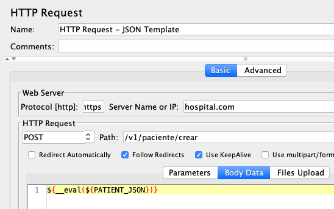

En esta entrada abordamos el tema de usar plantillas (templates) en el proceso de pruebas de carga para APIs. Este blog es, en cierta forma, una continuación de nuestro [blog](https://jmeterenespanol.org/blog/2020-06-02-properties-carlos/) anterior donde proponíamos las ventajas de alterar los script de JMeter **externamente** y en forma **dinámica**. Si bien es cierto que esta técnica es compleja, es importante conocerla e incorporarla en su portafolio de herramientas.

## El Ejemplo

Como sabemos, normalmente las pruebas de carga para APIs requieren enviar un bloque de data en el formato JSON. (Nota: este bloque de data se conoce en inglés como *payload*). Este bloque esta compuesto por un conjunto de pares de nombre/valores como sigue:

```
{
  "Paciente":{
    "Identificación": "123456789",
    "Médico": "Dr. MataSanos",
    "Hospital": "LaBuenaMuerte"
  }
}
```

En nuestro ejemplo, el propósito de la prueba es crear *pacientes* en una determinada aplicación. Para ello incluimos un elemento *HTTP Request* donde añadimos el *payload* en el *Body Data* del pedido:


El gráfico muestra como la variable **Identificación** es asignada a un número random usando una parte de la variable [__UUID](https://jmeter.apache.org/usermanual/functions.html#__UUID). También definimos las variables **Médico** y **Hospital** cuyos valores serán leídos usando el elemento [CSV Data Set Config](https://jmeter.apache.org/usermanual/component_reference.html#CSV_Data_Set_Config). Este es el proceso estándar.

## El Problema

El problema surge cuando los componentes del API cambian causando que tengamos que editar el script (usando el GUI) para alterar la estructura JSON. Este problema se multiplica cuando esta estructura es utilizada por múltiples scripts.

## La Alternativa

La alternativa es crear una plantilla/template que contenga la estructura JSON y allí definir los valores en forma dinámica. Una vez definida la plantilla la guardamos en un archivo nombrado **patient_template.json**.
 
 ```
{
  "Paciente":{
    "Identificación": "LT${__substring(${__UUID()}, 0, 8)}",
    "Médico": "${__eval(${MD_NAME})}",
    "Hospital": "${__eval(${HOSPITAL_NAME})}"
  }
}
```

Es importante señalar que esta plantilla contiene solamente las **referencias** al valor de las variables. Los datos (médico y hospital) actualmente están contenidos en el file CSV (como mencionamos antes). Noten que usamos la función de JMeter [__eval](https://jmeter.apache.org/usermanual/functions.html#__eval) para forzar la evaluación de las variables al momento de la ejecución.

Implementamos esta técnica en tres pasos:

### Paso 1:


Usando el elemento de Configuración [User Defined Variables](https://jmeter.apache.org/usermanual/component_reference.html#User_Defined_Variables) creamos/asignamos una variable que contiene el lugar donde el file de la plantilla reside.

### Paso 2:


Usando el elemento de [Pre-Processor User Parameters](https://jmeter.apache.org/usermanual/component_reference.html#User_Parameters), creamos/asignamos un parámetro (PATIENT_JSON) que durante la ejecución toma el valor de la plantilla, de esta manera:

```
PATIENT_JSON={
 "Paciente":{
    "Identificación": "LT${__substring(${__UUID()}, 0, 8)}",
    "Médico": "${__eval(${MD_NAME})}",
    "Hospital": "${__eval(${HOSPITAL_NAME})}"
  }
}
```

### Paso 3:


Finalmente, en este paso agregamos al **Body Data** del HTTP Request una expresión, que al momento de ejecución, asignará valores a las variables MD_NAME y HOSPITAL_NAME en forma dinámica. Estos valores son extraídos del respectivo file CSV.

## Conclusión

El uso de plantillas/templates en un script proporciona la flexibilidad y productividad que resultan en un incremento substantivo en la eficiencia en la elaboración de los *scripts* de pruebas de carga.