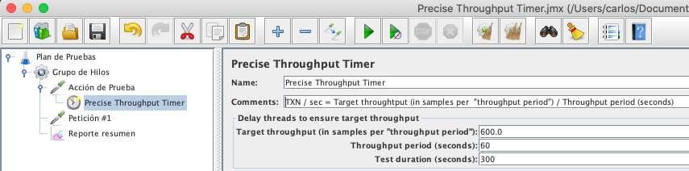

En esta entrada abordamos el uso de un temporizador que caracteriza por enviar transacciones en forma muy similar como usuarios reales usan una aplicación. Empezamos revisando los tipos the temporizadores ofrecidos en JMeter.

## Categorías de Temporizadores

JMeter ofrece dos tipos de temporizadores. Una categoría es usada principalmente para insertar pausas (llamado Think Time en Inglés) entre peticiones con el propósito de emular el comportamiento humano. En esta categoría esta el *Temporizador Constante*, *Temporizador Aleatorio Uniforme*, *Temporizador Aleatorio Guassiano*, y otros.

La segunda categoría esta compuesta por temporizadores que tienen como objetivo regular el **ratio de arribo** de los Grupos de Hilos (sesiones), en otras palabras, configurar la **carga** (throughput) deseada. Este ratio de arribo está determinado por el **intervalo** de tiempo de ejecución entre **hilos** (Vusers), que en Inglés se conoce como **Pacing**. Dentro de esta categoría están el [*Constant Throughput Timer*](https://jmeter.apache.org/usermanual/component_reference.html#Constant_Throughput_Timer) y el [*Precise Throughput Timer*](https://jmeter.apache.org/usermanual/component_reference.html#Precise_Throughput_Timer).

**NOTA**: ver mis entradas de blog [aqui](https://jmeterenespanol.org/blog/2020-01-28-pacingtechnique-1-2-carlos/) y [aqui](https://jmeterenespanol.org/blog/2020-02-14-pacingtechnique-2-2-carlos/) acerca de otra técnica para controlar el ratio de arribo.

## Carga vs. Concurrencia

Estos dos conceptos son críticos para entender la diferencia en el uso de los tipos de temporizadores.

|Carga|Concurrencia
|---|---
|Determinada por el **Pacing**|Determinada por el **Think Time**
|Intervalo entre **sesiones** del universo usuarios|Intervalo entre **peticiones** dentro de una sesión
---

## Precise Throughput Timer (PTT)

Como mencionamos previamente, el *Precise Throughput Timer* (PTT) y *Constant Throughput Timer* (CTT) tienen como propósito regular el arribo de hilos (Vusers). La principal diferencia entre estos dos temporizadores esta en que el CTT inserta un pausa **constante** mientras que el CTT inserta un pausa **aleatoria**. Esta pausa aleatoria modela una distribución de Poisson que (como se ha demostrado) es como los usuarios interactúan con una aplicación.

## Configuration del PTT

La configuración tiene dos aspectos. El primero aspecto tiene que ver con la ubicación del elemento en el plan de pruebas. El temporizador deberá ser incluido al *inicio* del Group de Hilos debajo de un elemento de [**Acción de Prueba**](https://jmeter.apache.org/usermanual/component_reference.html#Flow_Control_Action) (ver imagen a continuación).

El segundo aspecto es la configuración del temporizador en si mismo, y se basa un concepto simple: establecer el **gol/objetivo del Throughput** deseado.



En el ejemplo, el Throughput (TXN/Sec) deseado es como sigue:

```
Target Throughput (samples x "Throughput period") / Throughput period (secs)

600 TXN / 60 Segundos = 10 TXN por Segundo
```
Adicionalmente, es necesario asignar la duración del test: *Test Duration* en segundos.

Con estos parámetros, el PTT crea (en memoria/RAM) un esquema de despacho de como los hilos van ha ser instanciados durante de la prueba.

## Consideraciones

1. Usar un Grupo de Hilos normal.
2. **Configurar el Grupo de Hilos con el número necesario de hilos/vusers**.
3. Configurar el Grupo de Hilos con un *Ramp-up* y *Startup delay* igual a cero.
4. Configurar el Grupo de Hilos con un *Loop Count* infinito.
5. Configurar el Grupo de Hilos con la misma duración (*Test duration*, mencionado previamente).
6. No usar expresiones variables en la configuración.

**NOTA:** Consideración #2 es muy importante porque sin un número adecuado de hilos la prueba no podrá alcanzar el objetivo del Throughput deseado. La sugerencia es observar la bitácora de errores.

## Conclusión

El temporizador PTT nos ofrece un herramienta para diseñar una prueba que caracteriza por enviar transacciones en forma muy similar como usuarios reales usan una aplicación.

Carlos A. Godinez - Senior Lead Performance Engineer

https://www.linkedin.com/in/carlosgodinez/

Facebook: https://www.facebook.com/groups/jmeterenespanol

Slack: https://jmeterenespanol.slack.com/